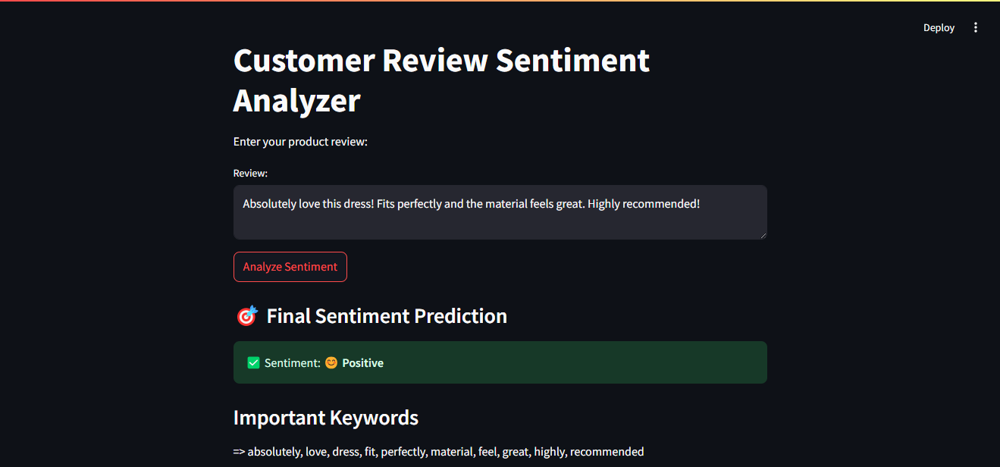
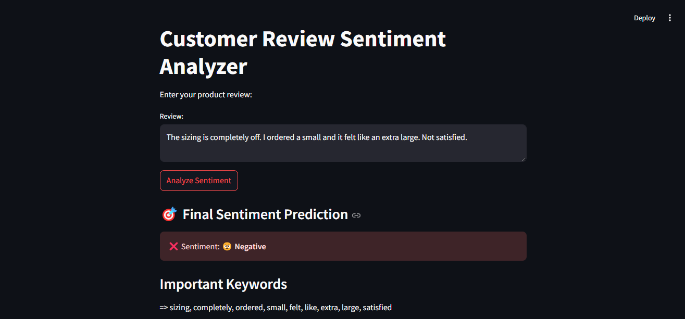

# 🤖 Customer Review Sentiment Analysis Chatbot

An intelligent chatbot built using **NLP and Machine Learning** that classifies customer reviews as **Positive** or **Negative**, while also displaying detailed preprocessing steps like tokenization, stemming, lemmatization, and keyword extraction.

Deployed using **Streamlit** for a smooth and interactive user experience.

---

## 🛠️ Technologies Used

Frontend: Streamlit
NLP Processing: NLTK
Data Handling: Pandas
Model Deployment: Streamlit Cloud
Dataset Source: [Kaggle Dataset](https://www.kaggle.com/datasets/nicapotato/womens-ecommerce-clothing-reviews) |

---

## 🚀 Features

- Real-time text classification using ML
- TF-IDF Vectorizer + Logistic Regression
- Tokenization, Lemmatization, Stopword Removal
- Displays extracted important keywords
- Simple & clean web interface with Streamlit

---

## 🧠 How It Works

1. **Data Preprocessing** (`process.ipynb`):
   - Clean text, remove punctuation
   - Tokenize, Lemmatize, Remove Stopwords
   - Vectorize using TF-IDF
   - Train `LogisticRegression` model
   - Save model + vectorizer as `.pkl` files

2. **Web App Interface** (`app.py`):
   - Input review from user
   - Preprocess and vectorize
   - Predict sentiment
   - Display prediction and key keywords

---

## 🖼️ App Screenshots

### 💬 Chatbot Interface  

---

## 📊 Dataset

**Womens Clothing E-Commerce Reviews**  
📦 [Kaggle Dataset](https://www.kaggle.com/datasets/nicapotato/womens-ecommerce-clothing-reviews)  
- ~23,000 reviews
- Used the `Review Text` and `Recommended IND` fields for model training

---

## 🧠 Model

- **Vectorization**: TF-IDF (Term Frequency–Inverse Document Frequency)
- **Algorithm**: Logistic Regression
- **Accuracy**: ~92%
- **Libraries Used**: 
  - `pandas`, `sklearn`, `nltk`, `pickle`

---

## 🧪 Sample Customer Reviews for Testing

Here are **5 real customer reviews** from the Women's E-Commerce Clothing Reviews dataset that you can use to test the chatbot's sentiment analysis capability.

1. 🟢 Review 1
> **"Absolutely love this dress! Fits perfectly and the material feels great. Highly recommended!"**
2. 🔴 Review 2 
> **"The sizing is completely off. I ordered a small and it felt like an extra large. Not satisfied."**

3. 🟢 Review 3 
> **"Great quality top. I’ve washed it a few times and it still looks brand new. Will buy again!"**

4. 🔴 Review 4 
> **"The fabric is cheap and itchy. I returned it the next day. Very disappointed."**

5. 🟡 Review 5 
> **"Nice design but the sleeves are a bit tight. Still wearable though, so I kept it."**

---

